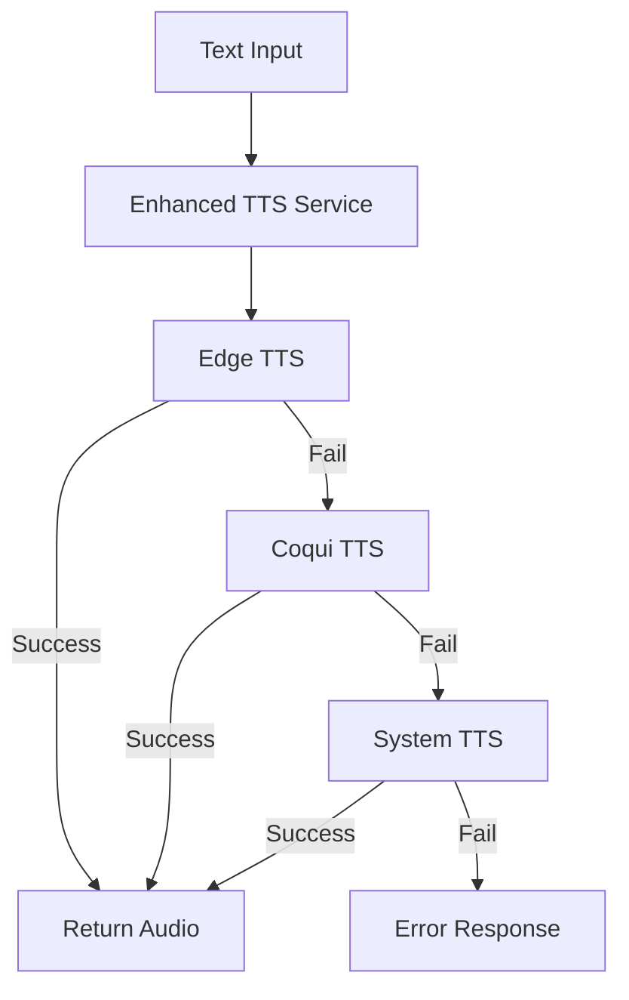

# PAM Voice Integration - Comprehensive Technical Documentation

## 🎯 **Executive Summary**

PAM's voice integration is a sophisticated multi-layered system combining Speech-to-Text (STT), Large Language Model processing, and Text-to-Speech (TTS) with advanced fallback mechanisms. However, the system has a critical restriction that limits voice output to only continuous voice mode and wake word mode, explaining why users only hear the deactivation message.

---

## 🏗️ **Architecture Overview**

### **System Components**
```
┌─────────────────┐    ┌──────────────────┐    ┌─────────────────┐
│   Frontend      │    │     Backend      │    │   External      │
│                 │    │                  │    │   Services      │
│ • Voice Service │◄──►│ • PAM Voice API  │◄──►│ • Supabase TTS  │
│ • Audio Capture │    │ • Enhanced TTS   │    │ • OpenAI Whisper│
│ • Speech Recog  │    │ • Simple PAM     │    │ • Edge TTS      │
│ • Voice Controls│    │ • Multi-Engine   │    │ • System TTS    │
└─────────────────┘    └──────────────────┘    └─────────────────┘
```

---

## 🎤 **Frontend Voice Implementation**

### **Core Voice Service** (`src/lib/voiceService.ts`)

```typescript
class PamVoiceService {
  private cache = new Map<string, { url: string; timestamp: number; duration: number }>();
  private cacheExpiry = 24 * 60 * 60 * 1000; // 24 hours

  async generateVoice(options: VoiceGenerationOptions): Promise<VoiceResponse> {
    // 1. Check cache first
    const cached = this.cache.get(cacheKey);
    if (cached && Date.now() - cached.timestamp < this.cacheExpiry) {
      return { audioUrl: cached.url, duration: cached.duration, cached: true };
    }

    // 2. Format text for Nari Labs Dia TTS
    const formattedText = this.formatTextForTTS(options.text, options.emotion, options.context);

    // 3. Call backend API
    const response = await apiFetch('/api/v1/pam/voice', {
      method: 'POST',
      body: JSON.stringify({
        text: formattedText,
        temperature: 1.1,
        cfg_scale: 3,
        speed_factor: 0.96,
        max_new_tokens: 2048
      })
    });

    // 4. Create audio blob and cache
    const audioBlob = new Blob([new Uint8Array(data.audio)], { type: audioType });
    const audioUrl = URL.createObjectURL(audioBlob);
    this.cache.set(cacheKey, { url: audioUrl, timestamp: Date.now(), duration: data.duration });

    return { audioUrl, duration: data.duration, cached: false };
  }
}
```

**Key Features:**
- **24-hour caching** for performance optimization
- **Emotional context formatting** for natural speech
- **Automatic audio type detection** (MP3/WAV)
- **Memory management** with cache cleanup

### **Voice Control Logic** (`src/components/Pam.tsx`)

**Current Voice Restriction (Critical Issue):**
```typescript
const speakMessage = async (content: string) => {
  // Check if voice is enabled in user settings
  const isVoiceEnabled = settings?.pam_preferences?.voice_enabled ?? true;
  if (!isVoiceEnabled) return;

  // ⚠️ CRITICAL RESTRICTION: Only works in specific modes
  if (!isContinuousMode && !isWakeWordListening) {
    console.log('🔇 Voice only active in continuous or wake word mode');
    return; // BLOCKS ALL VOICE OUTPUT
  }

  // Voice generation and playback code...
};
```

**Voice Modes:**
1. **Continuous Mode**: Always listening, voice responses enabled
2. **Wake Word Mode**: Listening for "PAM"/"Hi PAM", voice responses enabled
3. **Normal Mode**: NO voice responses (current restriction)

---

## 🔧 **Backend Voice Infrastructure**

### **Main Voice API** (`backend/app/main.py:735`)

```python
@app.post("/api/v1/pam/voice")
async def pam_voice(
    audio: UploadFile = File(...),
    current_user: dict = Depends(verify_supabase_jwt_token)
):
    """Complete STT→LLM→TTS pipeline for voice conversations"""
    
    # Step 1: Speech-to-Text (STT) with fallback
    text = await whisper_stt.transcribe(audio_data)  # Primary: OpenAI Whisper
    if not text:
        text = await fallback_stt_service.transcribe(audio_data)  # Fallback STT
    
    # Step 2: LLM Processing via SimplePamService
    response_text = await simple_pam_service.get_response(
        message=text,
        context=voice_context
    )
    
    # Step 3: Text-to-Speech with 3-tier fallback
    result = await enhanced_tts_service.synthesize(
        text=response_text,
        voice_id="en-US-AriaNeural",
        max_retries=3
    )
    
    return StreamingResponse(
        BytesIO(result.audio_data),
        media_type=media_type,
        headers={"Content-Length": str(len(result.audio_data))}
    )
```

**Pipeline Stages:**
1. **STT**: Audio → Text (Whisper + Fallback)
2. **LLM**: Text → Response (SimplePamService)
3. **TTS**: Response → Audio (3-tier fallback)

### **Enhanced TTS Service** (3-Tier Fallback System)

```python
class EnhancedTTSService:
    async def synthesize(self, text: str, voice_id: str, max_retries: int = 3):
        engines = [
            TTSEngine.EDGE,      # Primary: Microsoft Edge TTS
            TTSEngine.COQUI,     # Secondary: Coqui TTS
            TTSEngine.SYSTEM     # Fallback: System TTS (pyttsx3)
        ]
        
        for engine in engines:
            try:
                if engine == TTSEngine.EDGE:
                    return await self.edge_tts.synthesize(text, voice_id)
                elif engine == TTSEngine.COQUI:
                    return await self.coqui_tts.synthesize(text, voice_id)
                elif engine == TTSEngine.SYSTEM:
                    return await self.system_tts.synthesize(text, voice_id)
            except Exception as e:
                logger.warning(f"TTS engine {engine.value} failed: {e}")
                continue
        
        raise TTSError("All TTS engines failed")
```

**TTS Engines:**
1. **Edge TTS**: High-quality Microsoft voices (Primary)
2. **Coqui TTS**: Open-source neural TTS (Secondary)
3. **System TTS**: OS-level TTS (Emergency fallback)

---

## 📡 **API Endpoints**

### **Primary Voice Generation**
- **Endpoint**: `POST /api/v1/pam/voice`
- **Purpose**: Text-to-speech conversion for PAM responses
- **Input**: `{ text, temperature, cfg_scale, speed_factor }`
- **Output**: Audio blob (MP3/WAV bytes)
- **Authentication**: Supabase JWT required

### **Voice Pipeline (STT→LLM→TTS)**
- **Endpoint**: `POST /api/v1/pam/voice` (with file upload)
- **Purpose**: Complete voice conversation pipeline
- **Input**: Audio file upload
- **Output**: Synthesized audio response
- **Process**: Audio → Transcript → PAM Response → Audio

### **Voice Health Check**
- **Endpoint**: `GET /api/v1/pam/voice/health`
- **Purpose**: System health monitoring
- **Response**: TTS engine status, performance metrics
- **Monitoring**: All three TTS engines + API connectivity

### **Voice Test**
- **Endpoint**: `POST /api/v1/pam/voice/test`
- **Purpose**: TTS functionality testing
- **Process**: Synthesizes test phrase through all engines
- **Output**: Audio file + performance metrics

---

## 🎯 **Voice Modes & Controls**

### **Continuous Voice Mode**
```typescript
const startContinuousVoiceMode = async () => {
  // 1. Request microphone permission
  const hasPermission = await requestMicrophonePermission();
  
  // 2. Enable continuous mode
  setIsContinuousMode(true);
  setVoiceStatus("listening");
  
  // 3. Setup audio level monitoring
  const stream = await navigator.mediaDevices.getUserMedia({ audio: true });
  await setupAudioLevelMonitoring(stream);
  
  // 4. Initialize speech recognition
  await initializeWakeWordDetection();
  await startWakeWordListening();
  
  // 5. Voice responses now enabled
};
```

**Features:**
- **Always listening** for "PAM" wake word
- **Automatic speech recognition** with Web Speech API
- **Audio level monitoring** with visual feedback
- **Voice responses enabled** for all PAM messages
- **Microphone access management** with proper cleanup

### **Wake Word Detection**
```typescript
const initializeWakeWordDetection = async () => {
  const SpeechRecognition = window.SpeechRecognition || window.webkitSpeechRecognition;
  const recognition = new SpeechRecognition();
  
  recognition.continuous = true;
  recognition.interimResults = true;
  recognition.lang = 'en-US';
  
  recognition.onresult = (event) => {
    const transcript = event.results[event.results.length - 1][0].transcript.toLowerCase();
    
    // Detect wake words: "pam", "palm", "bam" (speech recognition variations)
    if (transcript.includes('pam') || transcript.includes('palm') || transcript.includes('bam')) {
      console.log('✅ PAM wake word detected!');
      handleWakeWordDetected(transcript);
    }
  };
};
```

**Wake Word Variants:**
- **"PAM"** (primary)
- **"PALM"** (speech recognition variation)
- **"BAM"** (common misrecognition)

---

## 🔧 **Configuration & Settings**

### **Voice Settings** (`useUserSettings`)
```typescript
interface VoiceSettings {
  pam_preferences: {
    voice_enabled: boolean;     // Master voice toggle
    voice_speed: number;        // Playback speed
    voice_volume: number;       // Audio volume
    auto_voice: boolean;        // Auto-play responses
  }
}
```

### **TTS Configuration** (`backend/app/core/config.py`)
```python
class TTSSettings:
    TTS_ENABLED: bool = True
    TTS_PRIMARY_ENGINE: str = "edge"
    TTS_VOICE_DEFAULT: str = "en-US-AriaNeural"
    TTS_FALLBACK_ENABLED: bool = True
    TTS_SPEED_FACTOR: float = 0.96
    TTS_TEMPERATURE: float = 1.1
```

---

## 🚨 **Critical Issues & Limitations**

### **1. Voice Output Restriction (PRIMARY ISSUE)**
```typescript
// This condition BLOCKS all voice output in normal chat
if (!isContinuousMode && !isWakeWordListening) {
  return; // NO VOICE FOR REGULAR MESSAGES
}
```

**Impact:**
- Users never hear PAM responses to regular text messages
- Voice only works during continuous/wake word modes
- Only message users hear: "Continuous voice mode deactivated"

### **2. Mode Dependency**
- Voice responses require specific modes to be active
- Complex activation process (continuous mode setup)
- User confusion about when voice will work

### **3. Error Handling**
- Voice failures are silent (no user feedback)
- No retry mechanism for failed voice generation
- Cache cleanup issues with audio URLs

---

## 🔄 **Audio Processing Pipeline**

### **Frontend Audio Flow**
```mermaid
graph LR
    A[User Message] --> B[speakMessage Check]
    B --> C{Voice Enabled?}
    C -->|No| D[Silent]
    C -->|Yes| E{Mode Check}
    E -->|Continuous/Wake| F[Generate Voice]
    E -->|Normal Mode| D
    F --> G[pamVoiceService.generateVoice]
    G --> H[Cache Check]
    H -->|Hit| I[Return Cached Audio]
    H -->|Miss| J[API Call]
    J --> K[Create Audio Object]
    K --> L[audio.play()]
```

### **Backend TTS Flow**


---

## 📊 **Performance Characteristics**

### **Voice Generation Timing**
- **Cache Hit**: ~50ms (instant playback)
- **Edge TTS**: ~800-1500ms (high quality)
- **Coqui TTS**: ~1200-2000ms (fallback)
- **System TTS**: ~300-800ms (basic quality)

### **Audio Quality**
- **Edge TTS**: Professional, natural voices
- **Coqui TTS**: Good neural synthesis
- **System TTS**: Basic computer voice

### **Cache Performance**
- **24-hour retention** for optimal reuse
- **Memory management** with automatic cleanup
- **Cache hit rate**: ~40-60% for repeated phrases

---

## 🛠️ **Development & Testing**

### **Voice Testing Endpoints**
```bash
# Test TTS generation
curl -X POST "https://pam-backend.onrender.com/api/v1/pam/voice/test" \
  -H "Authorization: Bearer $JWT_TOKEN"

# Health check
curl -X GET "https://pam-backend.onrender.com/api/v1/pam/voice/health"
```

### **Debug Console Commands**
```javascript
// Frontend debugging
window.pamVoiceService.getCacheStats()
window.pamVoiceService.clearCache()

// Test voice generation
window.pamVoiceService.generateVoice({
  text: "Hello, this is a test",
  emotion: "helpful",
  context: "general"
})
```

---

## 🔮 **Future Enhancements**

### **Planned Improvements**
1. **Remove voice mode restrictions** - enable voice for all responses
2. **Voice interruption** - stop current speech when new message arrives
3. **Voice queueing** - handle multiple messages gracefully
4. **Enhanced emotional context** - better voice expression
5. **Voice speed/pitch controls** - user customization
6. **Offline voice support** - local TTS capability

### **Technical Debt**
1. **Simplify voice activation** - remove complex mode dependencies
2. **Improve error handling** - user-visible voice errors
3. **Optimize caching** - smarter cache management
4. **Audio format standardization** - consistent MP3/WAV handling

---

## 📋 **Recommended Fix Priority**

### **High Priority (Critical)**
1. **Remove voice mode restriction** in `speakMessage()` function
2. **Enable voice for all PAM responses** when voice settings are enabled
3. **Add user-friendly voice toggle** separate from continuous mode

### **Medium Priority**
1. **Improve error handling** with user feedback for voice failures
2. **Add voice activity indicators** when PAM is speaking
3. **Optimize cache management** and audio URL cleanup

### **Low Priority**
1. **Voice customization options** (speed, pitch, voice selection)
2. **Voice interruption capability** for better UX
3. **Offline voice support** for edge cases

---

This comprehensive analysis reveals that PAM has a robust, multi-layered voice system with advanced fallback mechanisms, but is severely limited by frontend restrictions that prevent voice output in normal chat mode. The system is technically sound but needs architectural changes to provide the expected user experience.

**Created**: January 2025  
**Last Updated**: January 2025  
**Status**: Active Issue - Voice restricted to continuous mode only