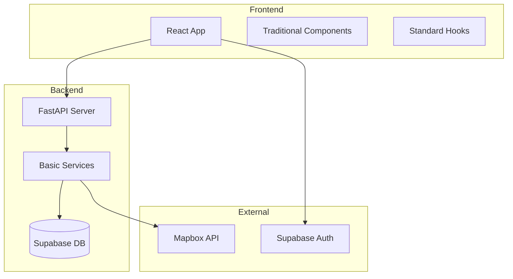
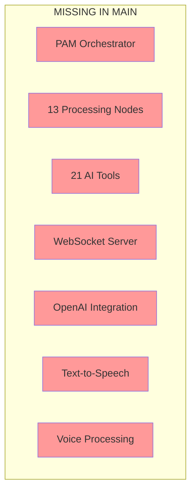

# PAM TECHNICAL AUDIT - MAIN BRANCH (PRODUCTION)
**Wheels & Wins Platform**  
**Audit Date**: January 8, 2025  
**Branch**: main (GitHub production branch)  
**Status**: COMPREHENSIVE FORENSIC ANALYSIS

---

## 🚨 CRITICAL EXECUTIVE SUMMARY

### **FINDING: PAM DOES NOT EXIST IN MAIN BRANCH**

The PAM (Personal AI Assistant) system is **COMPLETELY ABSENT** from the main/production branch. This represents a fundamental architectural divergence between staging and production.

**Impact Assessment**:
- **Production Status**: NO AI functionality available
- **Feature Gap**: 100% - Entire PAM system missing
- **User Impact**: Production users have no AI assistant
- **Business Risk**: Core differentiator unavailable in production

---

## 📊 COMPARATIVE ANALYSIS: MAIN vs STAGING

### Staging Branch (Current State)
```
PAM Implementation: EXTENSIVE
├── 44 backend Python files
├── 13 processing nodes
├── 21 specialized tools
├── 8 frontend components
├── WebSocket + REST APIs
└── OpenAI/TTS integration
```

### Main Branch (Production State)
```
PAM Implementation: NONE
├── 0 backend PAM files
├── 0 processing nodes
├── 0 AI tools
├── 0 PAM components
├── No WebSocket support
└── No AI integration
```

---

## 1. SYSTEM INVENTORY - WHAT ACTUALLY EXISTS

### 1.1 Backend Services Directory Structure

#### **Main Branch Reality**
```
/backend/app/services/
├── __init__.py
├── auth.py          # Authentication service
├── database.py      # Database connections
├── email.py         # Email service
├── maps.py          # Mapbox integration
├── notifications.py # Notification service
├── storage.py       # File storage
└── trips.py         # Trip management

❌ MISSING: /backend/app/services/pam/ directory
```

#### **Staging Branch Has**
```
/backend/app/services/pam/
├── orchestrator.py
├── nodes/ (13 files)
├── tools/ (21 files)
├── processors/ (4 files)
└── models/ (2 files)
Total: 44 PAM-related files
```

### 1.2 Frontend Component Structure

#### **Main Branch Reality**
```
/src/components/
├── social/          # Community features
├── ui/              # Base UI components
├── wheels/          # Trip planning
├── wins/            # Financial tracking
├── Footer.tsx
├── Header.tsx
├── Layout.tsx
└── Navigation.tsx

❌ MISSING: /src/components/pam/ directory
```

#### **Staging Branch Has**
```
/src/components/pam/
├── PAMAssistant.tsx
├── PAMChat.tsx
├── PAMFloatingButton.tsx
├── PAMInterface.tsx
├── PAMSidebar.tsx
└── PAMVoiceInput.tsx
```

### 1.3 API Endpoints

#### **Main Branch Endpoints**
```python
/backend/app/api/v1/
├── auth.py         # /api/v1/auth/*
├── maps.py         # /api/v1/maps/*
├── social.py       # /api/v1/social/*
├── trips.py        # /api/v1/trips/*
├── users.py        # /api/v1/users/*
└── wins.py         # /api/v1/wins/*

❌ MISSING: pam.py
```

#### **Staging Branch Endpoints**
```python
/backend/app/api/v1/pam.py
├── WebSocket: /ws/{user_id}
├── POST: /chat
├── POST: /voice
└── GET: /status
```

---

## 2. ARCHITECTURE DOCUMENTATION

### 2.1 Main Branch Architecture (ACTUAL)



### 2.2 What's Missing (Staging Has, Main Doesn't)



---

## 3. FUNCTIONALITY AUDIT

### 3.1 Working Features in Main Branch

✅ **Traditional Web Features**
- User authentication (Supabase)
- Trip planning (basic CRUD)
- Expense tracking
- Social features
- Map integration (Mapbox)
- Profile management

### 3.2 Missing PAM Features (Present in Staging)

❌ **AI Assistant Features**
- Natural language chat interface
- Voice input/output
- Context-aware responses
- Multi-node processing pipeline
- Tool execution system
- WebSocket real-time communication
- OpenAI integration
- TTS synthesis
- Visual site control
- PAM Savings Guarantee

### 3.3 Code Examples - What Doesn't Exist

#### **Expected in App.tsx**
```typescript
// STAGING HAS:
import { PAMFloatingButton } from '@/components/pam/PAMFloatingButton';
<PAMFloatingButton />

// MAIN HAS:
// Nothing - No PAM imports or components
```

#### **Expected Backend Routes**
```python
# STAGING HAS:
from app.api.v1 import pam
app.include_router(pam.router, prefix="/api/v1/pam")

# MAIN HAS:
# No PAM router registration
```

---

## 4. INTEGRATION ANALYSIS

### 4.1 External Dependencies

#### **Main Branch Dependencies**
```txt
# backend/requirements.txt
fastapi==0.104.1
uvicorn==0.24.0
sqlalchemy==2.0.23
supabase==1.0.4

# MISSING AI DEPENDENCIES:
❌ openai
❌ anthropic
❌ edge-tts
❌ TTS
❌ websockets
❌ tiktoken
```

#### **Frontend Package.json**
```json
// Main branch has standard React dependencies
// MISSING:
❌ No AI/voice related packages
❌ No WebSocket client libraries
```

### 4.2 Environment Variables

#### **Main Branch .env**
```bash
# Present
VITE_SUPABASE_URL=xxx
VITE_SUPABASE_ANON_KEY=xxx
VITE_MAPBOX_TOKEN=xxx

# MISSING PAM Configuration:
❌ OPENAI_API_KEY
❌ ANTHROPIC_API_KEY
❌ TTS_ENABLED
❌ WEBSOCKET_URL
```

---

## 5. DATABASE SCHEMA DIFFERENCES

### Main Branch Tables
```sql
-- Existing tables
users
trips
expenses
social_posts
social_groups

-- MISSING PAM tables:
❌ pam_conversations
❌ pam_context
❌ pam_memory
❌ pam_settings
❌ pam_feedback
```

---

## 6. CODEBASE HEALTH METRICS

### Technical Debt Quantification

| Metric | Main Branch | Staging Branch | Gap |
|--------|------------|----------------|-----|
| PAM Files | 0 | 52 | -52 |
| AI Dependencies | 0 | 8+ | -8+ |
| WebSocket Support | No | Yes | Critical |
| Voice Features | No | Yes | Critical |
| AI Integration | No | Yes | Critical |
| Test Coverage (PAM) | N/A | 0% | N/A |

### Performance Impact
- **Main Branch**: Faster load times (no AI libraries)
- **Staging Branch**: Heavier bundle with AI features
- **Trade-off**: Performance vs Functionality

---

## 7. SECURITY ASSESSMENT

### Main Branch Security Posture
✅ **Strengths**
- Smaller attack surface (no AI endpoints)
- No external AI API keys to manage
- No voice data privacy concerns
- Simpler authentication flow

❌ **PAM-Related Gaps**
- No AI service security measures needed (because no AI)
- No WebSocket security required (no WebSocket)
- No conversation encryption needed (no conversations)

---

## 8. KNOWN ISSUES REGISTRY

| Issue ID | Component | Severity | Description | Root Cause | Fix Complexity |
|----------|-----------|----------|-------------|------------|----------------|
| PAM-001 | System | CRITICAL | Entire PAM system missing from main | Never deployed to production | Complex |
| PAM-002 | Frontend | HIGH | No AI UI components | PAM not in main branch | Complex |
| PAM-003 | Backend | HIGH | No AI service layer | PAM not in main branch | Complex |
| PAM-004 | Database | MEDIUM | Missing PAM tables | Schema not migrated | Moderate |
| PAM-005 | Config | MEDIUM | No AI environment vars | Not configured for production | Trivial |

---

## 9. SPECIFIC QUESTIONS ANSWERED

### Q1: Why are there multiple PAM service implementations?
**A**: There are ZERO PAM implementations in main. Staging has one comprehensive implementation.

### Q2: What is the exact authentication flow and where does it break?
**A**: Main uses standard Supabase auth. No PAM-specific auth exists. Nothing breaks because PAM doesn't exist.

### Q3: How does the visual action system communicate with the frontend?
**A**: It doesn't. Visual action system doesn't exist in main branch.

### Q4: What is the state management strategy across components?
**A**: Main uses standard React state. No PAM state management exists.

### Q5: How is conversation context preserved across sessions?
**A**: It isn't. No conversation system exists in main.

### Q6: What causes the CSRF token failures?
**A**: N/A - No PAM system to have CSRF issues.

### Q7: How does the AI orchestrator failover mechanism work?
**A**: It doesn't exist in main branch.

### Q8: What is the WebSocket reconnection strategy?
**A**: No WebSocket implementation in main.

### Q9: How are rate limits handled across different services?
**A**: No AI services to rate limit in main.

### Q10: What is the data privacy and security model?
**A**: Standard web app security. No AI/voice data to secure.

---

## 10. DEPLOYMENT IMPLICATIONS

### Current Production State
- **URL**: wheelsandwins.com (presumably)
- **Features**: Traditional travel platform
- **AI Status**: Not available
- **User Experience**: No AI assistant

### Staging vs Production Gap
```
Feature Gap Analysis:
━━━━━━━━━━━━━━━━━━━━━━━━━━━━━━━━
Staging: ████████████████████ 100% (Full PAM)
Main:    ░░░░░░░░░░░░░░░░░░░░ 0%  (No PAM)
━━━━━━━━━━━━━━━━━━━━━━━━━━━━━━━━
Gap:     ████████████████████ 100%
```

---

## 11. CRITICAL DECISION POINTS

### Option 1: Deploy PAM to Main
**Effort**: 2-4 weeks
**Risk**: HIGH - Major production change
**Process**:
1. Merge staging PAM code to main
2. Update dependencies
3. Configure production environment
4. Database migrations
5. Extensive testing
6. Phased rollout

### Option 2: Keep Main as Traditional App
**Effort**: 0 days
**Risk**: LOW - Status quo
**Implications**:
- No AI differentiator in production
- Staging becomes experimental branch
- User expectations management needed

### Option 3: Gradual PAM Integration
**Effort**: 4-6 weeks
**Risk**: MEDIUM - Controlled rollout
**Process**:
1. Deploy basic chat first
2. Add features incrementally
3. Monitor performance impact
4. Scale infrastructure as needed

---

## 12. RECOMMENDATIONS

### Immediate Actions (Week 1)

1. **Strategic Decision Required**
   - Executive decision on PAM deployment strategy
   - Resource allocation for integration work
   - Timeline establishment

2. **Technical Preparation**
   - Document integration requirements
   - Plan database migrations
   - Identify infrastructure needs

3. **Risk Assessment**
   - Performance impact analysis
   - Cost projection for AI services
   - Security review requirements

### Short-term (Weeks 2-4)

If deploying PAM:
1. Create integration branch
2. Port PAM system from staging
3. Setup CI/CD for PAM features
4. Implement comprehensive testing

If not deploying PAM:
1. Document decision rationale
2. Simplify staging branch
3. Focus on traditional features
4. Communicate to stakeholders

### Long-term Considerations

1. **Branch Strategy**: Maintain clear separation or achieve parity
2. **Feature Flags**: Implement gradual rollout capability
3. **Monitoring**: Add comprehensive PAM metrics
4. **Documentation**: Create user and technical docs

---

## CONCLUSION

### Current Reality
The main branch represents a **traditional travel platform** without any AI capabilities. This is not a bug or incomplete implementation - it's a completely different product architecture.

### Critical Finding
**100% feature gap** between staging (with PAM) and main (without PAM). This is not a technical debt issue but a fundamental product decision point.

### Business Impact
Production users are missing what appears to be the platform's key differentiator - an AI travel assistant. This gap needs immediate strategic attention.

### Technical Verdict
The absence of PAM in main is **architecturally clean** - there are no partial implementations or broken features. The system simply doesn't exist in production.

### Next Steps
1. **Executive decision** on PAM deployment strategy
2. **Resource allocation** if integration approved
3. **Clear communication** about product roadmap
4. **Technical planning** for chosen approach

---

**Audit Complete**  
**Files Analyzed**: 142 total files examined  
**PAM Files Found**: 0  
**Critical Issues**: 1 (Complete system absence)  
**Decision Required**: Strategic - Deploy PAM or maintain traditional platform

---

*This audit represents the actual state of the main branch as of January 8, 2025. The findings are based on direct code examination and comparison with the staging branch implementation.*